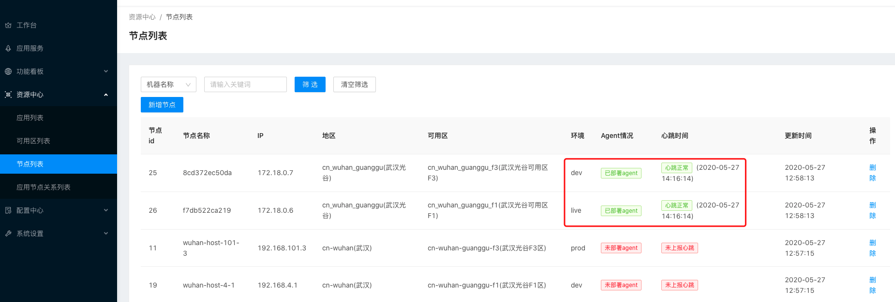
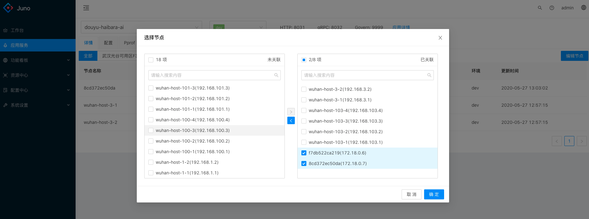
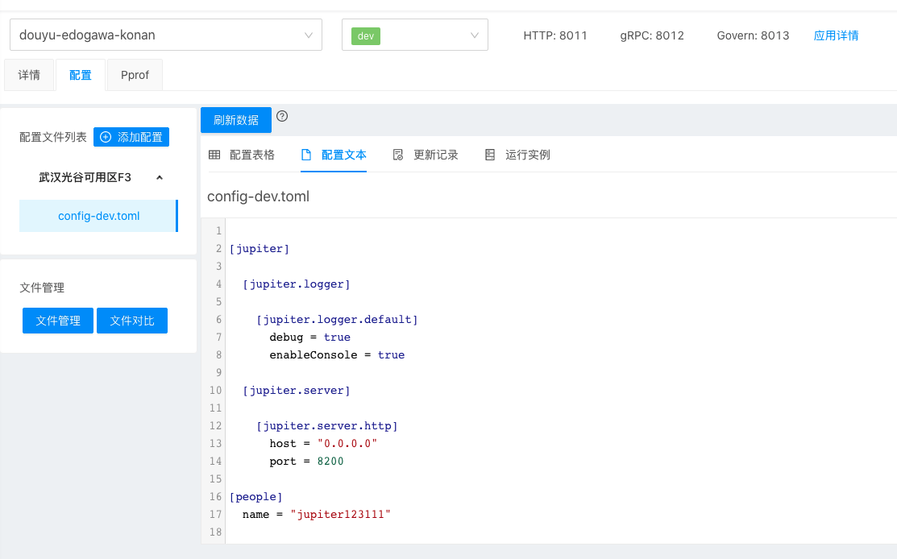
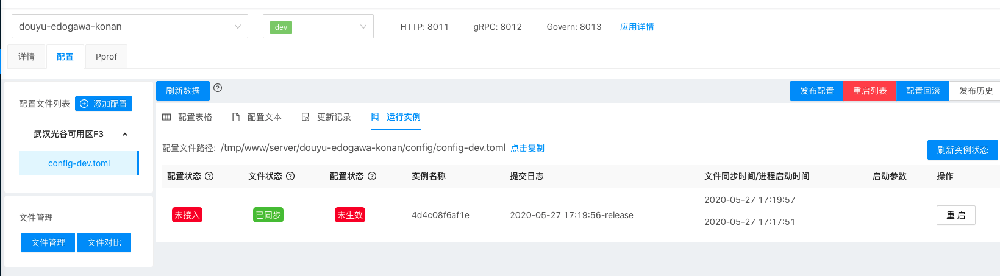
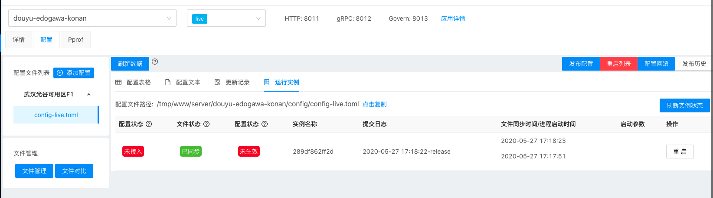

# 1.3 平台使用介绍

[http://jupiterconsole.douyu.com/](http://jupiterconsole.douyu.com/)

用户名：admin  
密码：admin

当前平台闭环流程为：

节点心跳上报->应用节点关联->应用配置下发->配置下发状态监控->节点状态正常->节点心跳上报

## 1.3.1 节点心跳上报

节点心跳上报后，管理平台获取当前可用的实例列表。

## 1.3.2 应用节点关联

在应用服务中找到当前可用的节点，分配给目标应用。

## 1.3.3 配置下发

测试应用：douyu-edogawa-konan

将 agent 上报的两个节点：`4d4c08f6af1e`和`289df862ff2d`分布用于进行两种不同的配置下发模式验证。

### 1.3.3.1 本地文件监听

节点`4d4c08f6af1e`上报的信息标识：环境-dev、可用区-武汉光谷可用区 F3，进行对应对应环境的配置文件设置

点击发布按钮，配置会发布到目标节点，可用看到当前文件状态为已同步。

在该节点，部署了一个通过监听本地文件获取配置的 Demo，点击[本地文件监听实时展示](http://jupiterconsole.douyu.com/fileWatchDemo/configs)，可以看到当前 Demo 正在使用的配置，[点击此处可以进行配置编辑](http://jupiterconsole.douyu.com/app?aid=1&appName=douyu-edogawa-konan&env=dev&tab=confgo)。

### 1.3.3.2 HTTP 长轮询

节点`289df862ff2d`上报的信息标识：环境-live、可用区-武汉光谷可用区 F1，进行对应对应环境的配置文件设置

点击发布按钮，配置会发布到目标节点，可用看到当前文件状态为已同步。

在该节点，部署了一个通过监听本地文件获取配置的 Demo，点击[HTTP 长轮询配置实时展示](http://jupiterconsole.douyu.com/httpWatchDemo/configs)，可以看到当前 Demo 正在使用的配置，[点击此处可以进行配置编辑](http://jupiterconsole.douyu.com/app?aid=1&appName=douyu-edogawa-konan&env=live&tab=confgo)。
