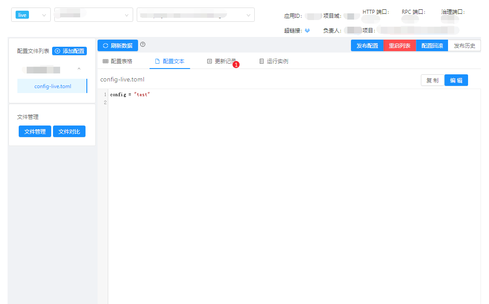
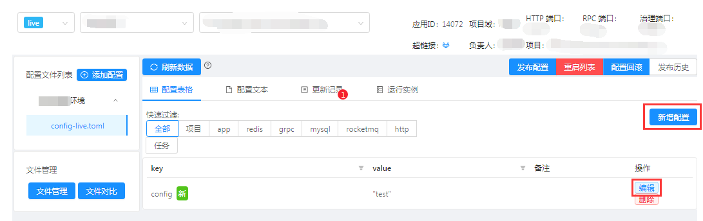
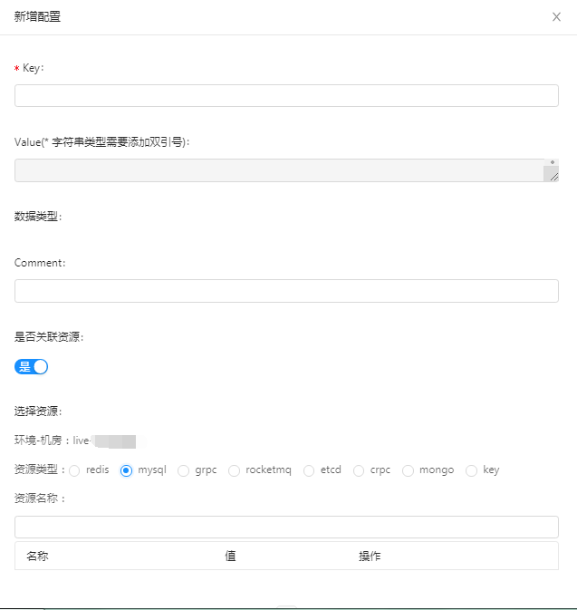

# 3.4 交互设计

## 3.4.1 界面概览

下图是配置中心的项目配置首页。

- 页面左侧，可进行环境与机房的切换；
- 页面中央，展示了两种不同的配置展现形式：
- 配置表格、配置文本。用户进入时默认以配置文本的方式进行交互，优点是接近文本的使用方式。用户也可以切换到配置表格，切换之后可以很便捷的使用资源变量；
- 页面上方，用户可进行配置发布、实例重启、配置回滚和查看发布历史的操作。

 
### 3.4.1.1 配置表格交互

用户使用配置文本方式，不再赘述。下列图片展示配置表格的使用方式，以及配置变量的使用。

点击新增配置，有两种配置的新增方式：Key-Value 和资源变量的使用。默认情况下，用户输入 Key 和 Value 点击保存即可；用户使用配置变量的流程：点击关联资源按钮、选择资源类型、最后到配置列表中点击需要的配置即可使用。

### 3.4.1.2 配置文本交互

**基础操作**

1. 点击配置文本，切换到配置文本编辑界面；
1. 点击编辑，开启编辑器交互功能；
1. 编辑器中写入配置文件，点击保存。

       在编辑状态下可进行格式化、预览变更等操作。

**预览变更**
预览变更会直观的暂时配置的修改情况。

**应用配置发布**

    用户点击配置发布按钮后，可以直观的看到本次要发布的配置与目前线上配置的差异，在填写发布信息之后点击提交按钮，即完成发布。    

**应用配置追踪**

    跟踪文件下发的三个状态：Systemd 接入状态、文件同步状态、配置文件使用状态。通过这三个状态可完全确认发布的配置是否是成功生效的。

**全局资源管理**

    资源中心定义资源 k-v 的键值对，配置中心里通过对 key 对引用进行关联，当资源中心的资源值发生了变更，则配置中心在发布的时候会同步最新的资源进行发布，这样在迁移和维护资源时，对应用来说是无感知的，应用只需要重新发布一次应用就能完成资源配置项的更新。   **搜索界面**     管理后台提供资源变量管理界面，用户可以在这个页面进行资源的管理操作，包括：新增对应环境和机房的配置；修改资源参数；查询应用使用的依赖关系等功能，支持资源加密。    **新增资源**     新增资源变量：选择资源类型；确认环境和机房信息；输入资源名称，填写用户最后需要再配置文本中使用的配置值；增加备注信息；点击确定按钮即可完成资源变量增加，这里输入的资源变量数据，对其他使用者来讲值是加密不可见的。 

### 3.4.1.3 配置依赖解析

    配置管理后台加载配置解析的插件，周期性的解析目前的配置数据存入数据库中，可以更好地了解配置的使用情况，以及互相的依赖关系，快速筛选相关配置，根据配置以及服务的依赖关系我们提供了两种展示方式： 直接把关系用依赖图的方式表示； 

    用表格的方式展示各个项的详细属性；

  
