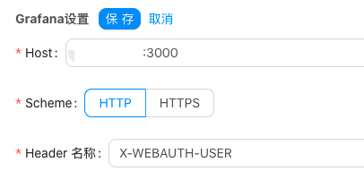
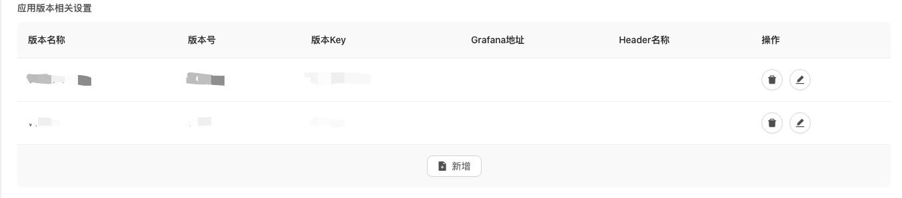
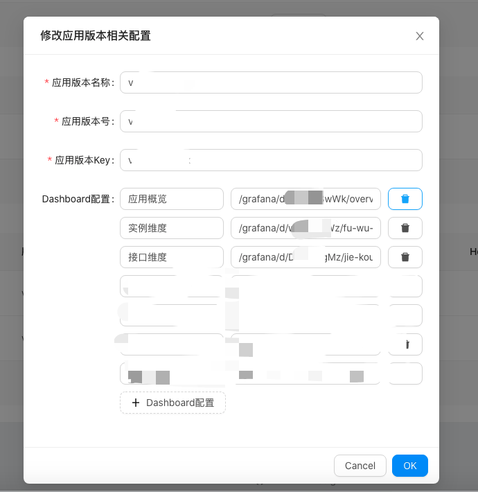

# 5.1 监控配置

## 5.1.1 流程
- 安装Grafana，不限制版本，建议使用最新版
- 修改Grafana配置，开始子域名访问与header头鉴权，开启iframe访问支持
- 导入Dashboard模板
- Juno后台设置

## 5.1.2 Grafana安装
 
按照官方文档安装即可  
[https://grafana.com/docs/grafana/latest/installation/debian/](https://grafana.com/docs/grafana/latest/installation/debian/)

```
sudo rpm -Uvh grafana-7.1.1-1.x86_64.rpm
```

## 5.1.3 Grafana配置调整


48 行
```
root_url = %(protocol)s://%(domain)s:%(http_port)s/grafana
```

51 行
```
serve_from_sub_path = true
```

```
allow_embedding = true
```

其他的鉴权配置，例如：是否开启登录界面、是否支持匿名访问等，根据自己的需求来即可。

### 5.1.4 Juno文件配置

配置文件里面增加如下配置
```
[grafanaProxy]
  enable = true
  name = "grafana"
```

### 5.1.5 Juno系统设置


#### 5.1.5.1 Grafana设置
进入管理后台：
系统设置->系统设置



Host：Grafana实际访问的地址，只填写 `IP:PORT`

```
X-WEBAUTH-USER
```

#### 5.1.5.2 应用监控设置
这里设计的目的是支持不同版本的监控Dashboard展示，一般情况下只需要配置一条记录即可。



#### 5.1.5.3 应用监控设置

- 应用版本名称，会在监控界面应用版本展示部分显示
- 应用版本号，指的是jupiter的版本，使用 `，`进行分割
- 用用版本key，目前配置应用监控版本的唯一标识，适用于Prometheus数据源指定


