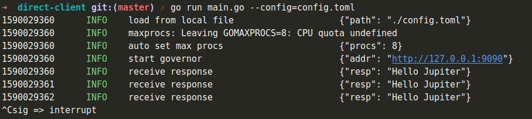
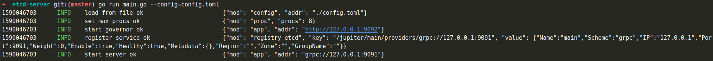
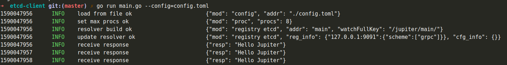

# 3.2 gRPC

## 3.2.1 gRPC介绍
``Jupiter``微服务目前支持``gRPC``，``Jupiter``对``gRPC``服务提供了很多可观察性的手段。

内置了多个中间件，可以采集请求日志、采集trace、采集监控、采集慢日志，更加方便我们对``gRPC``服务的可观测。

通过``govern``的治理端口，能够查看监控、HTTP实时信息

## 3.2.2 配置规范
[配置说明](../jupiter/6.3grpcserver.md)

## 3.2.3 直连的gRPC
参考[gRPC直连示例](https://github.com/douyu/jupiter/tree/master/example/grpc/direct)

### 3.2.3.1 启动gRPC服务
配置项
```toml
[jupiter.server.grpc]
    port = 9091
```

代码
```go
func main() {
	eng := NewEngine()
	eng.SetGovernor("127.0.0.1:9092")
	if err := eng.Run(); err != nil {
		xlog.Panic(err.Error())
	}
}

type Engine struct {
	jupiter.Application
}

func NewEngine() *Engine {
	eng := &Engine{}

	if err := eng.Startup(
		eng.serveGRPC,
	); err != nil {
		xlog.Panic("startup", xlog.Any("err", err))
	}
	return eng
}

func (eng *Engine) serveGRPC() error {
	server := xgrpc.StdConfig("grpc").Build()
	helloworld.RegisterGreeterServer(server.Server, new(Greeter))
	return eng.Serve(server)
}

type Greeter struct{}

func (g Greeter) SayHello(context context.Context, request *helloworld.HelloRequest) (*helloworld.HelloReply, error) {
	return &helloworld.HelloReply{
		Message: "Hello Jupiter",
	}, nil
}
```
运行指令``go run main.go --config=config.toml``，可以看到以下运行结果

从图中可以看到，我们启动了一个``gRPC``服务运行在``9091``端口，接下来我们启动客户端

### 3.2.3.2 启动gRPC客户端
配置项
```toml
[jupiter.client.directserver]
    address = "127.0.0.1:9091"
    balancerName = "round_robin" # 默认值
    block =  false # 默认值
    dialTimeout = "0s" # 默认值

```

代码
```go

func main() {
	eng := NewEngine()
	if err := eng.Run(); err != nil {
		xlog.Error(err.Error())
	}
}

type Engine struct {
	jupiter.Application
}

func NewEngine() *Engine {
	eng := &Engine{}
	if err := eng.Startup(
		eng.consumer,
	); err != nil {
		xlog.Panic("startup", xlog.Any("err", err))
	}
	return eng
}

func (eng *Engine) consumer() error {
	conn := grpc.StdConfig("directserver").Build()
	client := helloworld.NewGreeterClient(conn)
	for {
		resp, err := client.SayHello(context.Background(), &helloworld.HelloRequest{
			Name: "jupiter",
		})
		if err != nil {
			xlog.Error(err.Error())
		} else {
			xlog.Info("receive response", xlog.String("resp", resp.Message))
		}
		time.Sleep(1 * time.Second)
	}
	return nil
}
```
我们的``gRPC``客户端通过配置里的地址和负载均衡算法，可以请求刚才我们启动的``gRPC``服务端。运行指令``go run main.go --config=config.toml``，可以看到以下运行结果

我们定时1s，发送``hello``给``gRPC``服务端，可以收到服务端响应的``Hello Jupiter``


## 3.2.4 注册ETCD的gRPC服务
参考[gRPC注册ETCD示例](https://github.com/douyu/jupiter/tree/master/example/grpc/etcd)

### 3.2.4.2 启动gRPC服务
配置项
```toml
[jupiter.server.grpc]
    port = 9091  # 服务端grpc绑定端口
[jupiter.registry.wh]  # 注册grpc到etcd的配置
    connectTimeout = "1s"
    endpoints=["127.0.0.1:2379"]  # grpc注册到目标etcd中
    secure = false
    prefix = "wsd-reg" # 服务端注册到etcd的key前缀，配置客户端时候应该保持一致
```

代码
```go
package main

import (
    "context"
    "fmt"
    "github.com/douyu/jupiter"
    compound_registry "github.com/douyu/jupiter/pkg/registry/compound"
    etcdv3_registry "github.com/douyu/jupiter/pkg/registry/etcdv3"
    "github.com/douyu/jupiter/pkg/server/xgrpc"
    "github.com/douyu/jupiter/pkg/xlog"
    "google.golang.org/grpc/examples/helloworld/helloworld"
)

func main() {
    eng := NewEngine()
    eng.SetRegistry(
        compound_registry.New(
            etcdv3_registry.StdConfig("wh").Build(),
        ),
    )
    //eng.SetGovernor("0.0.0.0:0")
    if err := eng.Run(); err != nil {
        xlog.Error(err.Error())
    }
}

type Engine struct {
    jupiter.Application
}

func NewEngine() *Engine {
    eng := &Engine{}
    if err := eng.Startup(
        eng.serveGRPC,
    ); err != nil {
        xlog.Panic("startup", xlog.Any("err", err))
    }
    return eng
}

func (eng *Engine) serveGRPC() error {

    server := xgrpc.StdConfig("grpc").Build()
    helloworld.RegisterGreeterServer(server.Server, new(Greeter))
    return eng.Serve(server)
}

type Greeter struct {
    server *xgrpc.Server
}


func (Greeter) SayHello(context context.Context, request *helloworld.HelloRequest) (*helloworld.HelloReply, error) {
    sd := &helloworld.HelloReply{
        Message: "返回信息给client",
    }

    fmt.Println(fmt.Sprintf("name:%s",request.Name))
    return sd,nil
}

```
运行指令``go run main.go --config=config.toml``，可以看到以下运行结果

从图中可以看到，我们启动了一个``gRPC``服务运行在``9091``端口，在命令行的第四行，展示了我们注册的``key``和``value``信息。接下来我们在启动客户端。

### 3.2.4.2 启动gRPC客户端
配置项
```toml
[jupiter.registry.wh]
    connectTimeout = "1s"
    endpoints=["127.0.0.1:2379"]
    secure = false
    prefix = "wsd-reg" # 服务端注册到etcd的key前缀，配置客户端时候应该保持一致

[jupiter.client.etcdserver]
    address = "etcd:///main" #etcd:/// 默认前缀， main 指的是应用执行二进制文件名称(发布平台将它默认为应用名称). 框架内部会把 main解析出来跟前缀做拼接，去etcd找到对应grpc服务端注册key
    balancerName = "round_robin" # 默认值,grpc客户端调用服务端采用的 轮训模式
    block =  false # 默认值
    dialTimeout = "0s" # 默认值
    
```

grpc客户端代码demo
```go
package main

import (
    "context"
    "fmt"
    "time"

    "github.com/douyu/jupiter"
    "github.com/douyu/jupiter/pkg/client/grpc"
    "github.com/douyu/jupiter/pkg/client/grpc/balancer"
    "github.com/douyu/jupiter/pkg/client/grpc/resolver"
    "github.com/douyu/jupiter/pkg/registry/etcdv3"
    "github.com/douyu/jupiter/pkg/xlog"
    "google.golang.org/grpc/examples/helloworld/helloworld"
)

func main() {
    eng := NewEngine()
    if err := eng.Run(); err != nil {
        xlog.Error(err.Error())
    }
    fmt.Printf("111 = %+v\n", 111)
}

type Engine struct {
    jupiter.Application
}

func NewEngine() *Engine {
    eng := &Engine{}
    if err := eng.Startup(
        eng.initResolver,
        eng.consumer,
    ); err != nil {
        xlog.Panic("startup", xlog.Any("err", err))
    }
    return eng
}

func (eng *Engine) initResolver() error {
    resolver.Register("etcd", etcdv3.StdConfig("wh").Build())
    return nil
}

func (eng *Engine) consumer() error {
    config := grpc.StdConfig("etcdserver")
    //config.BalancerName = balancer.NameSmoothWeightRoundRobin
    client := helloworld.NewGreeterClient(config.Build())

    go func() {
        i:=0
        ghj := map[string]int{}
        for {

            i++
            resp, err := client.SayHello(context.Background(), &helloworld.HelloRequest{
                Name: fmt.Sprintf("jupiter:%d",i),
            })
            if err != nil {
                fmt.Printf("err = %+v\n%s", err,"iiiiiiiiiiiiiiiiiiiiiiiiiiiiiiiiiiiiiiiiiiiiiiiiiiiiiiiiiiiiiiiiiii")
                xlog.Error(err.Error())
            } else {
                ghj[resp.Message] = ghj[resp.Message] + 1
                fmt.Printf("resp.Message = %+v\n", ghj)
                xlog.Info("receive response", xlog.String("resp", resp.Message))
            }
            time.Sleep(1 * time.Second)
        }
    }()
    return nil
}
```
运行指令``go run main.go --config=config.toml``，可以看到以下运行结果

我们的``gRPC``客户端通过应用名称``main``从``ETCD``中获取到服务地址，并监听了``/wsd-reg/main``，用于后续更新服务地址。

客户端会定时1s，发送``hello``给``gRPC``服务端，可以收到服务端响应的``Jupiter 1` 类似信息到服务端`


