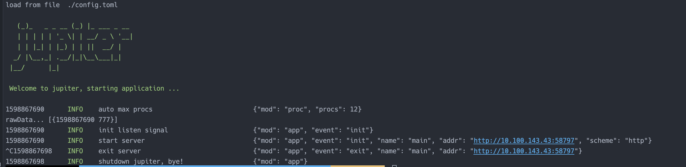

# 4.5 调用MongoDB

## 4.5.1 简介
store/mongo 包是对 gopkg.in/mgo.v2/bson 进行二次封装。

## 4.5.2 配置规范
[配置说明](http://jupiter.douyu.com/jupiter/6.9mongodb.html)

## 4.5.3 用法
[访问redis示例](https://github.com/douyu/jupiter/tree/master/example/store/mongo)

```go
// run: go run main.go --config=config.toml
package main

import (
	"fmt"
	"time"

	"github.com/douyu/jupiter"
	"github.com/douyu/jupiter/pkg/store/mongo"
	"github.com/douyu/jupiter/pkg/xlog"
	"gopkg.in/mgo.v2/bson"
)

// run: go run main.go -config=config.toml
type Engine struct {
	jupiter.Application
}

func NewEngine() *Engine {
	eng := &Engine{}
	if err := eng.Startup(
		eng.exampleMongo,
	); err != nil {
		xlog.Panic("startup", xlog.Any("err", err))
	}
	return eng
}

func main() {
	app := NewEngine()
	if err := app.Run(); err != nil {
		panic(err)
	}
}

func (eng *Engine) exampleMongo() (err error) {
	session := mongo.StdConfig("test").Build()
	defer session.Close()

	// write
	m := make(map[string]interface{}, 0)
	m["dateline"] = time.Now().Unix()
	m["rid"] = 777

	err = session.DB("test").C("test").Insert(m)
	if err != nil {
		panic(err)
	}

	// read
	type MongoData struct {
		Dateline int64 `bson:"dateline"`
		Rid      int64 `bson:"rid"`
	}
	var rawData []MongoData
	err = session.DB("test").C("test").Find(bson.M{"rid": 777}).Sort("-time").All(&rawData)
	if err != nil {
		panic(err)
	}
	fmt.Println("rawData...", rawData)
	return
}
```
执行 go run main.go --config=config.toml,可以看到如下图结果



