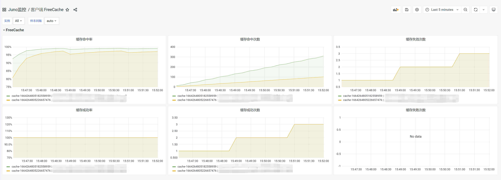

# 4.9 调用本地缓存

## 4.9.1 简介
pkg/cache/xfreecache 包是对freecache库进行二次封装，用于本地缓存并支持metric上报

frercache特性：
- 可存储数以百万计条目
- 零垃圾收集负荷
- 高并发而且线程安全的访问
- 纯 Go 语言实现
- 支持对象失效
- 近乎 LRU 的算法
- 严格限制内存使用

## 4.9.2 用法
### 1 初始化实例
#### 1) 使用默认的初始化方式
- 初始化方式
```go
type Instance struct {
	localCache *xfreecache.LocalCache
}

func NewInstance() *Instance {
	return &Instance{
		localCache: xfreecache.DefaultConfig().Build(),
	}
}
```
- 默认配置详情：缓存容量：`256MB`   失效时间：`2分钟`  是否开启metric上报：`是`
```go
type Config struct {
	Size          Size          // 缓存容量,最小512*1024 【必填】
	Expire        time.Duration // 失效时间 【必填】
	DisableMetric bool          // metric上报 false 开启  ture 关闭【选填，默认开启】
	Name          string        // 本地缓存名称，用于日志标识&metric上报【选填】
}

// DefaultConfig 返回默认配置
func DefaultConfig() Config {
	return Config{
		Size:          256 * MB,
		Expire:        2 * time.Minute,
		DisableMetric: false,
		Name:          fmt.Sprintf("cache-%d", time.Now().UnixNano()),
	}
}
```


#### 2） 自定义初始化方式
```go
func NewInstance() *Instance {
	return &Instance{
		localCache: xfreecache.Config{
			Size:          128 * xfreecache.MB,
			Expire:        2 * time.Minute,
			DisableMetric: false,
			Name:          "bwList",
		}.Build(),
	}
}
```

### 2 函数方法介绍
```go
// GetAndSetCacheData 获取缓存后数据（内部已封装设置和获取本地缓存操作）【推荐使用】
// key 缓存key
// fn 获取返回数据需要执行的方法
// err fn返回的错误以及其他报错
func GetAndSetCacheData(key string, fn func() ([]byte, error)) (v []byte, err error)

// SetCacheData 设置本地缓存
// key 缓存key
// data 缓存value，传入序列化后的字节数组
func SetCacheData(key string, data []byte)

// GetCacheData 获取本地缓存
// key 缓存key
// data 缓存value
// err error
func GetCacheData(key string) (data []byte, err error) 

```


### 3 实际案例
```go
package bwlist

import (
	"context"
	"encoding/json"
	"fmt"
	"time"

	"git.dz11.com/vega/minerva/log"
	"github.com/douyu/jupiter/pkg/cache/xfreecache"
	"go.uber.org/zap"
)

type Instance struct {
	localCache *xfreecache.LocalCache
}

func NewInstance() *Instance {
	return &Instance{
		localCache: xfreecache.Config{
			Size:          128 * xfreecache.MB,
			Expire:        2 * time.Minute,
			DisableMetric: false,
			Name:          "bwList",
		}.Build(),
	}
}

type GetBWListRequest struct {
	// 黑白名单ID
	Id int32 `protobuf:"varint,1,opt,name=id" json:"id,omitempty"`
	// 1 白名单 2 黑名单
	LimitType int32 `protobuf:"varint,3,opt,name=limit_type,json=limitType" json:"limit_type,omitempty"`
}

func (i *Instance) GetBWListCached(ctx context.Context, req *GetBWListRequest) (res []int32, err error) {
	cacheKey := fmt.Sprintf("bwlist.GetBWList:%d:%d", req.Id, req.LimitType)
	data, err := i.localCache.GetAndSetCacheData(cacheKey, func() ([]byte, error) {
		data, innerErr := i.GetBWList(ctx, req)
		ret, _ := json.Marshal(data)
		return ret, innerErr
	})
	err = json.Unmarshal(data, &res)
	if err != nil {
		log.L(ctx).Error("bwlist GetBWListCached Unmarshal", zap.Any("req", req), zap.Error(err))
	}
	return
}

func (i *Instance) GetBWList(ctx context.Context, req *GetBWListRequest) (res []int32, err error) {
	// 可以根据实际业务具体实现方法
	res = []int32{123456}
	return
}
```

### 3 注意事项
- **缓存key的大小需要小于65535，否则无法存入到本地缓存中**（The key is larger than 65535）
- **缓存value的大小需要小于缓存总容量的1/1024，否则无法存入到本地缓存中**（The entry size need less than 1/1024 of cache size）

## 4.9.3 juno监控



